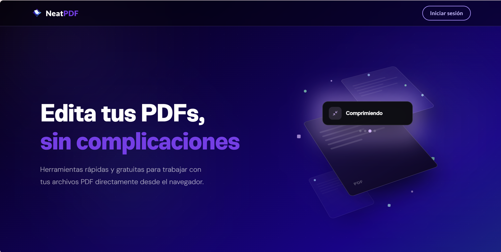
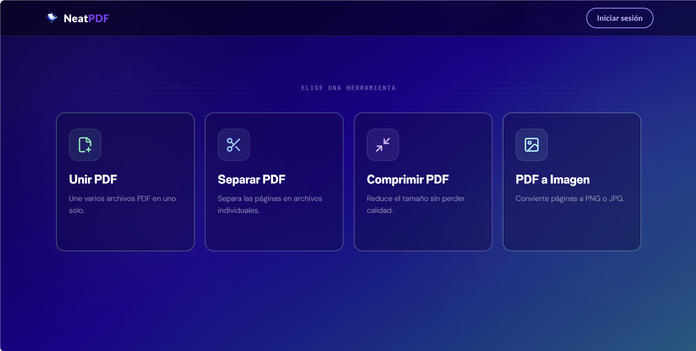
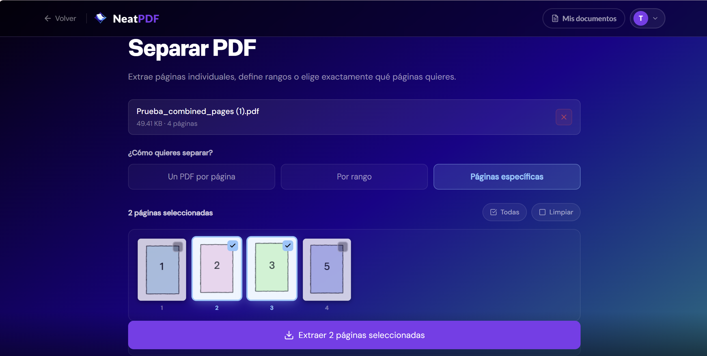
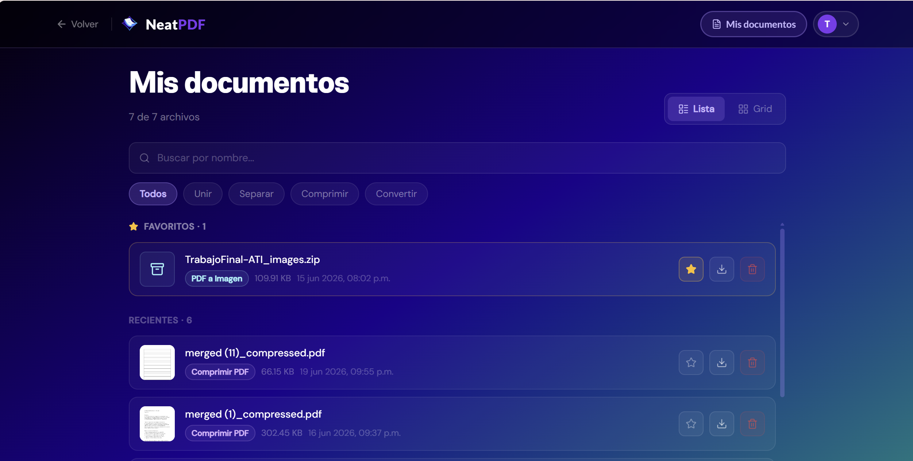
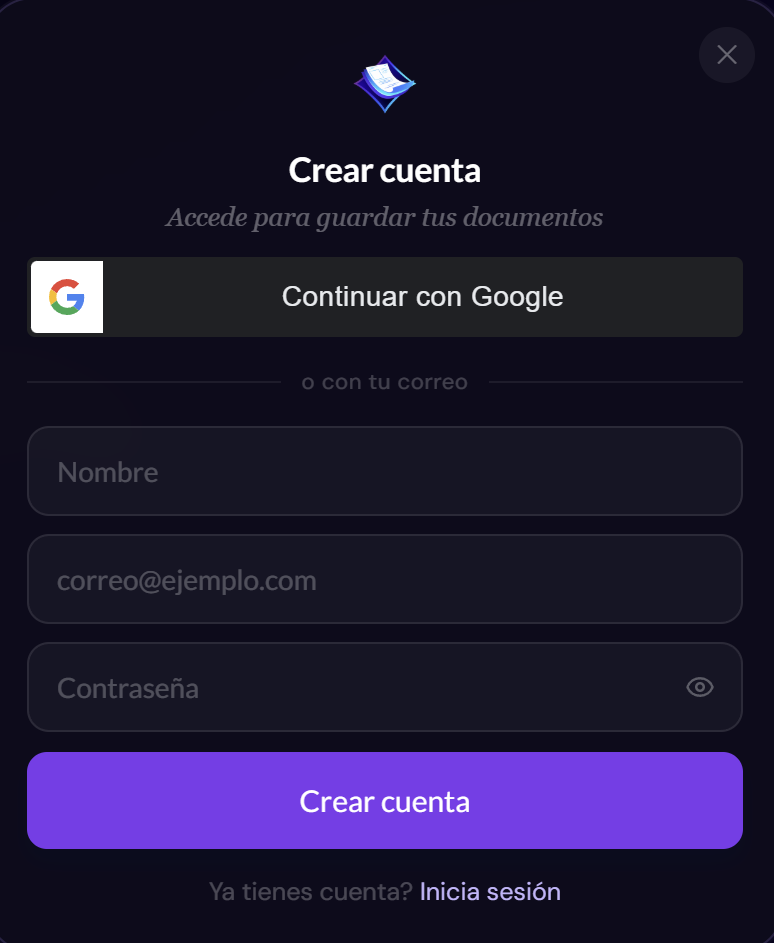
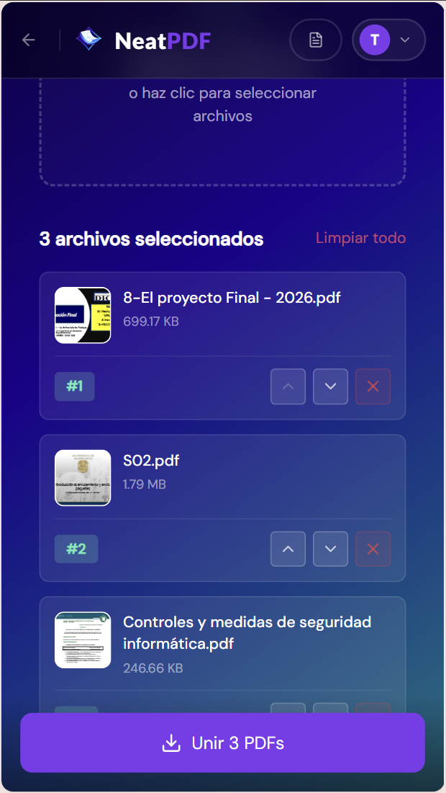

<div align="center">


 # NeatPDF — Frontend
 
**Herramientas PDF directo en tu navegador. Rápido, limpio y sin complicaciones.**
 
[Ver demo en vivo](https://neat-pdf-eta.vercel.app) · [Repositorio backend](../backend/README.md) · [Reportar un bug](https://github.com/Elviam/NeatPDF/issues)
 
</div>

 
## ¿Qué es NeatPDF?
 
NeatPDF es una aplicación web fullstack para manipular archivos PDF. Este repositorio contiene el **frontend**: una SPA construida con React 19 y Vite que se comunica con una API FastAPI para el procesamiento en el servidor.
 
El proyecto nació como portafolio para demostrar habilidades fullstack reales: autenticación con JWT y OAuth, diseño con sistema visual propio, y gestión de archivos binarios en el navegador.
 
---
 
## Funcionalidades
 
| Herramienta | Descripción | Estado |
|---|---|---|
| **Unir PDF** | Combina múltiples archivos en uno, con reordenamiento drag & drop y previsualización de páginas | ✅ Disponible |
| **Separar PDF** | Extrae rangos de páginas con previsualización en tiempo real | ✅ Disponible |
| **Comprimir PDF** | Reduce el peso del archivo sin pérdida visible de calidad | ✅ Disponible |
| **PDF a Imagen** | Convierte páginas a PNG/JPG descargables | ✅ Disponible |
| **Mis documentos** | Historial de archivos procesados con búsqueda, filtros y favoritos | ✅ Disponible |
| **Autenticación** | Registro, login con JWT y acceso rápido con Google OAuth | ✅ Disponible |
 
---
 
## Stack tecnológico
 
### Core
- **React 19** — UI declarativa con los últimos hooks y concurrent features
- **Vite 8** — Build tool con HMR ultrarrápido y bundle optimizado con Rolldown
- **React Router v7** — Enrutamiento client-side con layouts anidados
### Estilos
- **CSS3 + Tailwind CSS v4** — Sistema de diseño basado en CSS custom properties (--purple, --teal). Tailwind se usa como base de reset y utilities puntuales; el sistema visual glassmorphism se implementa con variables y estilos inline en los componentes.
### Archivos PDF
- **pdfjs-dist** — Renderizado y generación de miniaturas de páginas en el cliente
- **jszip** — Empaqueta múltiples archivos de salida en un `.zip` descargable
- **react-dropzone** — Zona drag & drop con validación de tipo y tamaño
### Comunicación
- **Axios** — Cliente HTTP con interceptores para adjuntar el token JWT automáticamente
- **@react-oauth/google** — Integración Google OAuth 2.0 sin dependencias pesadas
---
 
## Arquitectura de carpetas
 
```
frontend/
├── public/
│   └── vite.svg
├── src/
│   ├── components/
│   │   ├── Navbar.jsx            # Barra de navegación con avatar, dropdown y botón de retroceso
│   │   ├── Footer.jsx            # Footer con enlaces a páginas legales
│   │   ├── HeroAnimation.jsx     # Animación de fondo del Home
│   │   ├── ScrollToTop.jsx       # Resetea scroll en cambio de ruta
│   │   └── ProtectedRoute.jsx    # HOC para rutas que requieren autenticación
│   ├── pages/
│   │   ├── Home.jsx              # Landing con animación y cards de herramientas
│   │   ├── MergePDF.jsx          # Herramienta: unir PDFs con miniaturas
│   │   ├── SplitPDF.jsx          # Herramienta: separar páginas
│   │   ├── CompressPDF.jsx       # Herramienta: comprimir PDF
│   │   ├── ConvertToImage.jsx    # Herramienta: PDF a imagen
│   │   ├── MyDocuments.jsx       # Historial de documentos del usuario
│   │   ├── Login.jsx             # Formulario de acceso
│   │   ├── Register.jsx          # Formulario de registro
│   │   └── legal/                # HowToUse, FAQ, Privacy, Terms
│   ├── context/
│   │   └── AuthContext.jsx       # Estado global de autenticación (token, usuario)
│   ├── api/
│   │   └── axios.js              # Instancia de Axios con baseURL y token automático
│   ├── App.jsx                   # Definición de rutas
│   └── main.jsx                  # Punto de entrada, GoogleOAuthProvider
├── .env                          # Variables de entorno locales (no versionado)
├── .env.example                  # Plantilla de variables requeridas
├── package.json
└── vite.config.js
```
 
---
 
## Instalación y uso local
 
### Requisitos previos
 
- Node.js 20 LTS o superior
- El [backend de NeatPDF](../backend/README.md) corriendo en `http://localhost:8000`
### Variables de entorno
 
Copia el archivo de ejemplo y completa los valores:
 
```bash
cp .env.example .env
```
 
```env
# .env
VITE_API_URL=http://localhost:8000
VITE_GOOGLE_CLIENT_ID=tu_google_client_id_aqui
```
 
Para obtener un Google Client ID, crea un proyecto en [Google Cloud Console](https://console.cloud.google.com/) y configura las credenciales OAuth 2.0 con `http://localhost:5173` como origen autorizado.
 
### Pasos
 
```bash
# 1. Instalar dependencias
npm install
 
# 2. Iniciar servidor de desarrollo
npm run dev
```
 
La app estará disponible en `http://localhost:5173`.
 
---
 
## Scripts disponibles
 
```bash
npm run dev        # Servidor de desarrollo con HMR
npm run build      # Build de producción (salida en /dist)
npm run preview    # Previsualiza el build de producción localmente
npm run lint       # Análisis estático con ESLint
```
 
---
 
## Decisiones técnicas destacadas
 
**Portal para el botón de descarga fija**
El botón de descarga flotante que aparece tras procesar un archivo usa `ReactDOM.createPortal` anclado a `document.body`. Esto evita que un ancestro con `transform` o `z-index` rompa el posicionamiento `fixed`.
 
**Miniaturas de páginas con PDF.js**
En la herramienta de merge, cada página del PDF se renderiza como thumbnail en un `<canvas>` usando `pdfjs-dist`, sin enviar el archivo al servidor. Esto mejora la privacidad y reduce la latencia.
 
**Interceptor de Axios para JWT**
En lugar de pasar el token manualmente en cada petición, un interceptor de request lo adjunta automáticamente desde `localStorage` si existe.
 
**Google OAuth con componente `<GoogleLogin>`**
Se usa el componente de renderizado de `@react-oauth/google` en lugar del hook `useGoogleLogin` para evitar violaciones del orden de hooks cuando hay renders condicionales.
 
---
 
## Despliegue
 
El frontend está pensado para desplegarse en **Vercel** apuntando a la rama `main`.
 
```bash
# Build de producción
npm run build
# Los archivos estáticos quedan en /dist, listos para cualquier CDN
```
 
Variables de entorno requeridas en Vercel:
 
```
VITE_API_URL=https://tu-backend.onrender.com
VITE_GOOGLE_CLIENT_ID=tu_google_client_id_produccion
```
 
---
 
## Capturas de pantalla

### Home



### Separar PDFs


### Mis documentos


| Login | Mobile |
|---|---|
|  |  |
---
## Docker

Para correr el frontend en un contenedor junto con el backend:

```bash
# Desde la raíz del proyecto
docker compose up --build
```

El frontend se sirve con nginx en `http://localhost`.
La variable `VITE_API_URL` se inyecta en build time desde el `docker-compose.yml`.
---
## Licencia
 
MIT © 2026 Elvia — Proyecto de portafolio profesional.
